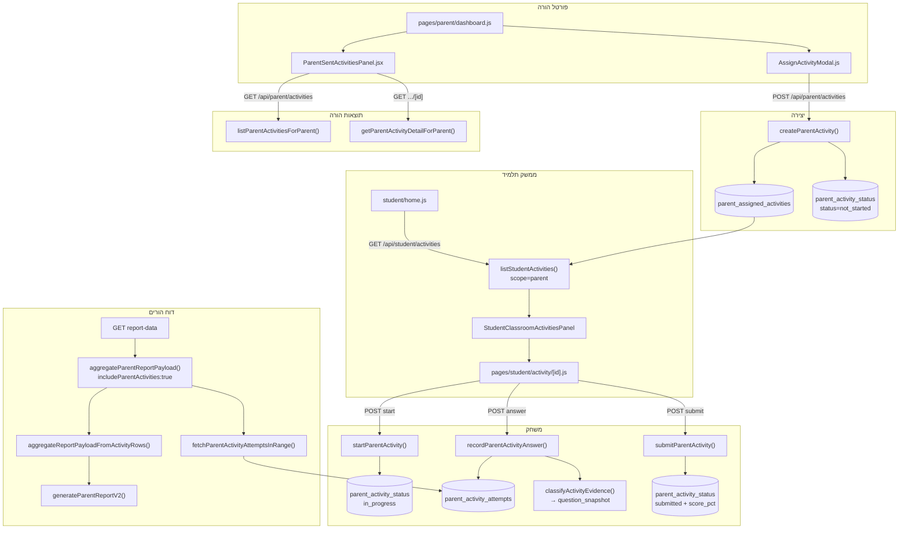
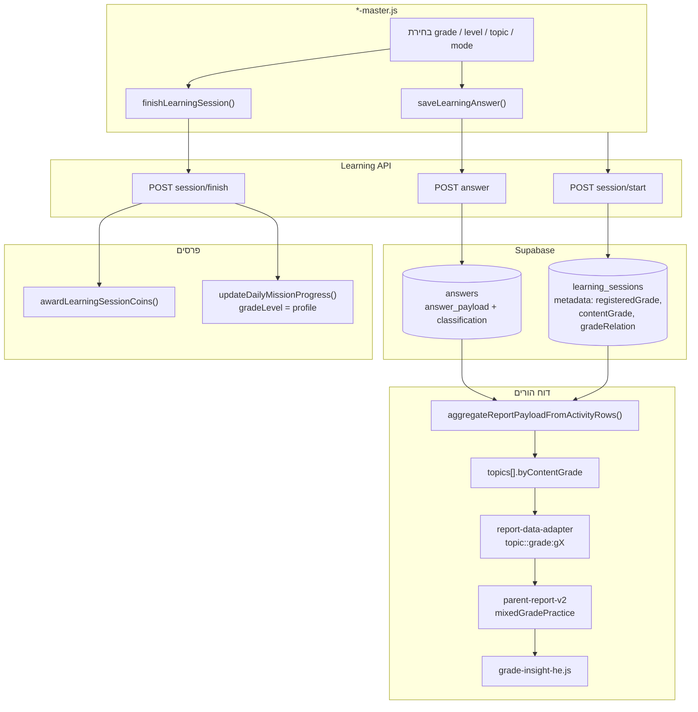

# Audit: פעילויות אישיות (מהורה) ותרגול עצמאי (ילד)

**תאריך:** 2026-06-15  
**סוג:** Read-only — ללא שינוי קוד, DB, UI, טקסטים, migrations או commits  
**מטרה:** לוודא שכל פעילות שהתלמיד מבצע — בין אם נשלחה מההורה ובין אם נבחרה עצמאית — **נשמרת, נספרת, משפיעה נכון על דוחות**, ולא הולכת לאיבוד.

**סטטוס כללי:** לא מוכרז PASS. נמצאו מסלולים מיושמים עם בדיקות יחידה/סקריפט חלקיות; חסרות הוכחות E2E מלאות ו-CI רציף למסלול פעילות מהורה.

---

## 1. Scope — מה נבדק

### בוצע

| תחום | מה נכלל |
|------|---------|
| **מסלול A** | יצירת פעילות מהורה → שמירה → הצגה לילד → start/answer/submit → תוצאות להורה → דוח הורים → השפעה על אבחון/המלצות/פרסים |
| **מסלול B** | בחירת מקצוע/כיתה/נושא ב-*-master → session/answer/finish → שמירת הקשר כיתה → דוח הורים → הבחנה חיזוק/התקדמות/פער/הצטיינות → פרסים/dashboard |
| **חוצה-מסלולים** | `includeParentActivities`, `activity-classification`, הפרדת מקורות ראיה (`self_practice` vs `parent_assigned_activity`), הפרדת כיתת תוכן vs כיתה רשומה, סינון ספרים/guided/step-by-step/discussion מאבחון |
| **שכבות** | DB migrations, API routes, server libs, UI components, report aggregation, PDF/Copilot truth packet |
| **בדיקות** | הרצה מקומית של test files ו-selftests רלוונטיים (ראו §8–10) |

### לא נבדק / מוגבל

| פריט | סיבה |
|------|------|
| **Production DB חי** | Audit על קוד ב-repo בלבד; לא נשאלו נתונים אמיתיים מ-Supabase |
| **E2E Playwright מלא** | דורש credentials וסביבת staging; לא הורץ במסגרת audit זה |
| **PDF בדפדפן אמיתי** | לא הורץ export חי; נבדק מסלול קוד בלבד |
| **Teacher scope `student`** (פעילויות אישיות ממורה) | מחוץ ל-scope המפורש; מוזכר רק כהבחנה מ-`scope: "parent"` |
| **Worksheets / PDF worksheets** | מחוץ ל-scope |
| **כל 6 masters ב-runtime** | נבדקו דפוסים מייצגים (math-master, practice-grade-resolution); לא נלחץ כל מקצוע בדפדפן |

---

## 2. קבצים / מודולים שנבדקו

### מסלול A — פעילות מהורה

| קובץ | תפקיד |
|------|--------|
| `supabase/migrations/051_parent_assigned_activities.sql` | סכמת 3 טבלאות: `parent_assigned_activities`, `parent_activity_status`, `parent_activity_attempts` |
| `supabase/migrations/054_assigned_activity_question_snapshot.sql` | snapshot + `question_key` |
| `supabase/migrations/055_phase3_raw_credited_time_columns.sql` | עמודות timing אופציונליות על attempts |
| `lib/parent-server/parent-activity.server.js` | create/list/detail/start/answer/submit |
| `lib/teacher-server/teacher-activities.server.js` | router מאוחד לתלמיד (`scope: "parent"`) |
| `lib/classroom-activities/student-activity-resume.server.js` | resume + מניעת תשובה כפולה |
| `lib/classroom-activities/assigned-activity-snapshot.server.js` | הקפאת `question_set` + grade per question |
| `pages/api/parent/activities/index.js` | POST create, GET list |
| `pages/api/parent/activities/[activityId].js` | GET detail |
| `pages/api/student/activities/*` | start / answer / submit |
| `components/parent/AssignActivityModal.js` | UI יצירה + שליחה |
| `components/parent/ParentSentActivitiesPanel.jsx` | מעקב הורה + modal תוצאות |
| `components/student/StudentClassroomActivitiesPanel.jsx` | סקשן "פעילות מההורים" |
| `pages/student/activity/[activityId].js` | מסך משחק משותף (class/teacher/parent) |
| `pages/parent/dashboard.js` | כניסה ל-AssignActivityModal |

### מסלול B — תרגול עצמאי

| קובץ | תפקיד |
|------|--------|
| `pages/learning/*-master.js` (6 מקצועות) | UI בחירת grade/topic/mode + save/finish |
| `lib/learning-client/learningActivityClient.js` | wrappers ל-session/answer/finish |
| `pages/api/learning/session/start.js` | יצירת session + metadata כיתה |
| `pages/api/learning/answer.js` | שמירת תשובה + classification |
| `pages/api/learning/session/finish.js` | duration, coins, missions |
| `lib/learning-supabase/practice-grade-resolution.js` | registered vs content grade (SSOT) |
| `lib/learning/activity-classification.js` | classification SSOT |
| `lib/learning/diagnostic-evidence-contract.js` | משקלים + סינון מקורות בהקשר parent |
| `lib/learning-supabase/evidence-source.js` | provenance keys |
| `utils/math-time-tracking.js` (+ analogs) | localStorage legacy (לא authoritative לדוח DB) |

### דוחות / aggregation

| קובץ | תפקיד |
|------|--------|
| `lib/parent-server/report-data-aggregate.server.js` | aggregation + `includeParentActivities` + `byContentGrade` |
| `lib/learning-supabase/report-data-adapter.js` | מפתחות `topic::grade:gX` |
| `lib/learning-supabase/parent-report-from-api-payload.js` | API → localStorage shim → `generateParentReportV2` |
| `pages/api/parent/students/[studentId]/report-data.js` | API דוח הורים |
| `lib/guardian-server/guardian-report.server.js` | דוח guardian עם parent activities |
| `utils/parent-report-v2.js` | מנוע דוח + `mixedGradePractice` |
| `utils/parent-report-language/grade-insight-he.js` | ניסוח grade scope לעברית |
| `utils/parent-copilot/truth-packet-v1.js` | truth packet ל-Copilot |
| `utils/parent-copilot/intent-answer-composers.js` | progression / above-below grade |
| `pages/learning/parent-report.js` | UI דוח + PDF export |

### בדיקות שנקראו / הורצו

| קובץ | סטטוס הרצה |
|------|------------|
| `tests/parent-server/parent-assigned-activities.test.mjs` | **נכשל בטעינה** (ראו §8) |
| `tests/classroom-activities/student-activity-resume.test.mjs` | PASS (7 tests) |
| `tests/learning/activity-classification.test.mjs` | PASS (43 tests) |
| `tests/learning/phase4-aggregate-filter.test.mjs` | PASS (כולל parent attempts classification) |
| `tests/learning/phase9-single-truth-progress.test.mjs` | PASS |
| `tests/learning/phase2-step-by-step.test.mjs` | נקרא, לא הורץ בנפרד (מכוסה ב-classification batch) |
| `tests/learning/evidence-quality-layer.test.mjs` | נקרא, לא הורץ בנפרד |
| `scripts/parent-activity-grade-evidence-selftest.mjs` | PASS (61 checks) |
| `scripts/parent-report-grade-scope-selftest.mjs` | PASS |
| `tests/e2e/student-home-personal-activities.spec.ts` | לא הורץ |

---

## 3. מפת זרימה — מסלול A (פעילות מהורה)



### צעדי מסלול A — מיפוי לדרישות

| # | שלב | מימוש | הוכחה |
|---|-----|--------|--------|
| 1 | יצירת פעילות מהורה | `AssignActivityModal` → `POST /api/parent/activities` → `createParentActivity` | קוד: **מוכח**. E2E: **לא נבדק** |
| 2 | בחירת מקצוע/כיתה/נושא/כמות | UI: `activityGradeKey`, subject, topic, difficulty, `questionCount` 1–30 | קוד: **מוכח** |
| 3 | שמירת metadata | עמודות ב-`parent_assigned_activities`; grade **per question** ב-`question_set` (לא עמודת grade נפרדת) | קוד + migration: **מוכח** |
| 4 | הצגה לילד | `listParentActivitiesForStudent` → panel "פעילות מההורים" | קוד: **מוכח**. E2E: **לא הורץ** |
| 5 | התחלה/המשך/סיום | start → resume index; submit מאפשר partial | קוד + resume tests: **מוכח** |
| 6 | שמירת תשובות | `parent_activity_attempts` בלבד — **לא** `public.answers` | קוד + static test בקובץ parent test (לא הורץ): **מוכח בקוד, לא מוכח בהרצה** |
| 7 | שמירת זמן | `time_spent_ms` + snapshot JSONB (`rawTimeSpentMs`, `creditedTimeMs`) | קוד: **מוכח**. עמודות migration 055: **לא נכתבות** (ראו MEDIUM) |
| 8 | attempts/status | `parent_activity_status`: not_started → in_progress → submitted | קוד: **מוכח** |
| 9 | תוצאות להורה | `ParentSentActivitiesPanel` + detail API | קוד: **מוכח** |
| 10 | כניסה לדוח | `report-data.js` עם `includeParentActivities: true` | קוד + static test: **מוכח בקוד** |
| 11 | חוזקות/חולשות/המלצות | attempts נספרים ב-aggregation; `guided_practice` → learning bucket (לא diagnostic) | phase4 test + selftest: **מוכח** ל-bucketing; קשר ישיר ל-UI המלצות: **לא מוכח E2E** |
| 12 | פרסים/התקדמות | **לא** נכלל ב-coins/monthly minutes (by design) | phase9 test: **מוכח** |
| 13 | פעילות שלא הושלמה | נשאר `in_progress`; submit לא חובה על כל השאלות; score = correct/question_count | קוד: **מוכח** |
| 14 | חזרה לפעילות | resume + duplicate guard + read-only על שאלות שנענו | resume tests: **מוכח** |

---

## 4. מפת זרימה — מסלול B (תרגול עצמאי)



### צעדי מסלול B — מיפוי לדרישות

| # | שלב | מימוש | הוכחה |
|---|-----|--------|--------|
| 1 | בחירת מקצוע | דף master per subject | קוד: **מוכח** |
| 2 | כיתה/רמה/נושא אחר | `<select>` grade ב-state; לא משנה profile | קוד: **מוכח** |
| 3 | שמירת הקשר מקורי | `practice-grade-resolution.js`: registered vs content + gradeRelation | קוד + grade-scope selftest: **מוכח** |
| 4 | שמירת תשובות | `answers` + classification at write | קוד: **מוכח** |
| 5 | שמירת זמן | per-answer `timeSpentMs`; session `duration_seconds` (עם cap 120s/question ב-master) | קוד: **מוכח**. cap: audit קודם (`STUDENT_QUESTION_TIME_AND_REWARD_IMPACT_AUDIT_2026-06-02.md`) |
| 6 | כניסה לדוח | `answers` ב-aggregation (תמיד, ללא flag) | קוד: **מוכח** |
| 7 | הורה רואה עבודה מחוץ לכיתה | `mixedGradePractice` + שורות `topic::grade:gX` | selftests: **מוכח** |
| 8 | הבחנה חיזוק/התקדמות/פער/הצטיינות | diagnostic engine v2 + `gradeScopeMeaningHe` + row tiers | selftest + קוד: **מוכח** לניסוח; לא כל השילובים: **ראו §10** |
| 9 | פרסים/dashboard/progress | coins + missions ב-finish; monthly minutes מ-`learning_sessions` | phase9: **מוכח** |
| 10 | עבודה חזקה בנושא מתקדם | `higher` + strength → enrichment phrasing | selftest (61 checks): **מוכח** |
| 11 | עבודה חלשה בנושא מתקדם | `higher` + needsSupport → "לא בהכרח פער בכיתה" | קוד: **מוכח**. test ייעודי: **לא מוכח** (רק strength path ב-selftest) |

---

## 5. טבלת DB / API / UI / Report

### מסלול A — פעילות מהורה

| שלב | DB | API | UI (תלמיד/הורה) | Report / PDF |
|-----|-----|-----|-----------------|--------------|
| יצירה | INSERT `parent_assigned_activities` + `parent_activity_status` | `POST /api/parent/activities` | `AssignActivityModal` | — |
| metadata | subject, topic, mode, difficulty, question_count, frozen `question_set[].grade` | body validation `parseCreateParentActivityBody` | grade picker per activity | grade מ-`question_snapshot` ב-aggregation |
| רשימה לילד | status filter active/closed | `GET /api/student/activities` | `StudentClassroomActivitiesPanel` | — |
| start | status → in_progress | `POST .../start` | `/student/activity/[id]` | — |
| answer | UPSERT `parent_activity_attempts` | `POST .../answer` | timing via `computeAssignedActivityTiming` | classification ב-snapshot |
| submit | status → submitted, score_pct | `POST .../submit` | confirm modal partial | attempts בטווח תאריכים |
| תוצאות הורה | joins status + attempts | `GET /api/parent/activities`, `GET .../[id]` | `ParentSentActivitiesPanel` | — |
| דוח | read `parent_activity_attempts` | `GET report-data` (`includeParentActivities: true`) | `parent-report.js` via API payload | אותו payload → PDF (`exportReportToPDF`) |
| provenance | — | — | — | `evidenceSourceCounts.parent_assigned_activity` |
| diagnostic | snapshot `isDiagnosticEligible` | — | mode UI=`guided_practice` only | learning bucket (לא diagnostic) ב-practice |

### מסלול B — תרגול עצמאי

| שלב | DB | API | UI | Report / PDF |
|-----|-----|-----|-----|--------------|
| session | `learning_sessions.metadata` | `POST session/start` | master state | session minutes ב-summary |
| answer | `answers.answer_payload` | `POST answer` | per-question timer | `byContentGrade`, diagnostic buckets |
| finish | duration + summary | `POST session/finish` | recordSessionProgress | coins לא בדוח; minutes כן |
| grade context | registered + content + relation | resolved server-side | grade `<select>` | `topic::grade:gX` keys |
| out-of-grade | same rows, sliced | — | — | `mixedGradePracticeNoteHe` |
| provenance | — | — | — | `self_practice` / `learning_book` |
| diagnostic | mode `practice`/`graded`/… | `classifyActivityEvidence(free_practice)` | learning mode excluded | diagnosticAccuracy separate |

### הבדלים ידועים UI ↔ API ↔ DB ↔ PDF

| נושא | UI | API/DB | Report/PDF | הערה |
|------|-----|--------|------------|------|
| mode פעילות מהורה | תמיד `guided_practice` | DB מאפשר גם `homework` | classification לפי mode ב-DB | UI לא חושף homework diagnostic |
| parent activities בדוח מורה/בית ספר | — | `includeParentActivities` **לא** true | לא נכלל | static test בקובץ parent (לא הורץ) |
| סיכומי subject | — | aggregation | **מערבב** כל content grades | שורות topic **מופרדות** |
| localStorage fallback | ישן | — | עלול לחסר grade metadata | DB path authoritative (phase9) |
| PDF vs UI | — | `stripInternalReportPayloadFields` | אותו מנוע V2 | **לא נבדק** export חי |

---

## 6. רשימת פערים (Gap List)

| ID | פער | מסלול | חומרה משוערת |
|----|-----|--------|--------------|
| G1 | `tests/parent-server/parent-assigned-activities.test.mjs` לא ב-CI ולא עבר הרצה מקומית (module not found) | A | HIGH |
| G2 | אין API לסגירה/ארכוב פעילות מהורה — `closed`/`archived` קיימים ב-DB בלבד | A | MEDIUM |
| G3 | UI הורה שולח רק `guided_practice` — לא diagnostic בפועל | A | MEDIUM (by design?) |
| G4 | פעילות מהורה **לא** משפיעה על coins / monthly minutes | A | LOW (by design; עלול לבלבל הורה) |
| G5 | עמודות `raw_time_spent_ms`/`credited_time_ms` ב-parent attempts — migration קיים, write path לא | A | LOW |
| G6 | `afterStepByStep` לא מועבר ב-API parent activity מה-UI | A | LOW |
| G7 | סיכומי subject מערבבים grades; רק topic rows מופרדים | B | MEDIUM |
| G8 | cap 120s/question על session minutes — undercount לעבודה עמוקה | B | HIGH (מוכח ב-audit קודם) |
| G9 | daily missions משתמשות ב-profile grade, לא content grade | B | MEDIUM |
| G10 | local-only report path — grade evidence עלול להיות חלקי | B | MEDIUM |
| G11 | `higher + weak` — פחות כיסוי test מ-`higher + strong` | B | MEDIUM |
| G12 | E2E personal activities — conditional skip | A+B | MEDIUM |
| G13 | `test:parent-activity-grade-evidence` לא ב-workflow CI parent-report | A+B | MEDIUM |

---

## 7. ממצאים לפי חומרה

### CRITICAL

| ID | ממצא | הוכחה |
|----|------|--------|
| — | **אין ממצא CRITICAL מוכח** במסגרת audit זה | לא נמצאה אובדן נתונים מוכח, bypass ל-classification, או דליפת parent data למורה |

> הערה: absence of CRITICAL ≠ PASS. חוסר E2E/CI מלא מונע הכרזת בטיחות production.

### HIGH

| ID | ממצא | ראיות | מסלול |
|----|------|-------|--------|
| H1 | **Test suite ראשי לפעילות מהורה לא רץ** — `parent-assigned-activities.test.mjs` נכשל בטעינה (`ERR_MODULE_NOT_FOUND: utils/hebrew-spelling-niqqud`) | הרצה מקומית 2026-06-15; לא ב-`package.json` scripts; לא ב-`.github/workflows/parent-report-tests.yml` | A |
| H2 | **Undercount זמן תרגול עצמאי** — cap 120s לשאלה על session minutes (משפיע על דוח "זמן עבודה" ופרסים) | `docs/audits/STUDENT_QUESTION_TIME_AND_REWARD_IMPACT_AUDIT_2026-06-02.md` + קוד masters | B |
| H3 | **פעילות מהורה לא נראית בדוחות מורה/בית ספר** — by design, אך הורה עשוי להניח שהמורה רואה | static assertion בקובץ test (לא הורץ) + קוד teacher/school report-data | A |

### MEDIUM

| ID | ממצא | ראיות | מסלול |
|----|------|-------|--------|
| M1 | **אין מנגנון סגירת פעילות מהורה** — פעילויות `active` ללא endpoint | grep API routes — לא נמצא write ל-`closed`/`archived` | A |
| M2 | **Submit partial** — score_pct = correct/question_count; שאלות שלא נענו נספרות כ"לא נכונות" implicit | `submitParentActivity` קוד | A |
| M3 | **Subject totals מערבבים grades** בעוד topic rows מופרדים | `report-data-aggregate.server.js` + `parent-report-v2.js` | B |
| M4 | **`higher + needsSupport` phrasing** — קיים ב-`grade-insight-he.js` (שורות 77–78) אך **לא** נבדק ב-selftest grade-evidence (רק strength paths) | קוד vs selftest coverage | B |
| M5 | **Grade-evidence selftest (61 checks) לא ב-CI** | `.github/workflows/parent-report-tests.yml` | A+B |
| M6 | **Guardian report כולל parent activities** (`includeParentActivities: true`) — עלול לסטות מתיעוד ישן | `guardian-report.server.js` שורות 137–142 | A |

### LOW

| ID | ממצא | ראיות | מסלול |
|----|------|-------|--------|
| L1 | Migration 055 timing columns על parent attempts — לא בשימוש ב-write path | קוד `recordParentActivityAnswer` | A |
| L2 | E2E `student-home-personal-activities.spec.ts` — skip אם אין activities | spec קוד | A |
| L3 | Parent activity time לא ב-monthly progress — by design | phase9 test | A |
| L4 | `homework` mode supported ב-API אך לא ב-UI הורה | `AssignActivityModal.js` `PARENT_ACTIVITY_MODE = "guided_practice"` | A |

---

## 8. בדיקות קיימות שמוכיחות (הורצו בהצלחה)

| בדיקה | מה מוכיח | תוצאה |
|-------|-----------|--------|
| `tests/learning/activity-classification.test.mjs` (43) | SSOT: learning/guided/discussion/book/step-by-step **לא** diagnostic | **PASS** |
| `tests/learning/phase4-aggregate-filter.test.mjs` | הפרדת diagnostic/learning/competitive; parent `guided_practice` → learning; parent `quiz` → diagnostic | **PASS** |
| `tests/learning/phase9-single-truth-progress.test.mjs` | parent attempts **לא** ב-monthly minutes; masters לא קוראים `addSessionProgress` | **PASS** |
| `tests/classroom-activities/student-activity-resume.test.mjs` (7) | resume index, duplicate guard, parent start wiring | **PASS** |
| `scripts/parent-activity-grade-evidence-selftest.mjs` (61) | הפרדת grade slices; provenance parent vs self; Copilot progression; higher+strength phrasing | **PASS** |
| `scripts/parent-report-grade-scope-selftest.mjs` | g4+g5 fractions → 2 שורות נפרדות; legacy gradeLevel guard | **PASS** |
| `tests/learning/evidence-quality-layer.test.mjs` (נקרא) | parent context: רק `free_practice` + `assigned_parent`; weight 0 ל-learning_context | **לא הורץ** — מוכח מקריאת קוד בלבד |

---

## 9. בדיקות קיימות שלא מוכיחות מספיק

| בדיקה | מה חסר |
|-------|--------|
| `tests/parent-server/parent-assigned-activities.test.mjs` | **לא הורץ** — כולל gate ל-`includeParentActivities`, no-write ל-`answers`, list/detail fields |
| `tests/e2e/student-home-personal-activities.spec.ts` | דורש env; skip conditional; לא מכסה answer/submit/report |
| `scripts/parent-activity-grade-evidence-selftest.mjs` | synthetic data — לא DB integration; **לא** בודק `higher+weak` phrasing |
| `phase4-aggregate-filter` parent quiz fixture | unit-level; fixture mode `quiz` לא insertable ל-DB (constraint `guided_practice`/`homework` only) |
| CI `parent-report-tests.yml` | לא כולל parent-assigned tests, grade-evidence selftest, classification tests |
| QA scripts (`scripts/qa/parent-report-*.mjs`) | simulation — **לא הורצו** במסגרת audit |

---

## 10. בדיקות חסרות (מומלצות עתידית — לא ליישום כאן)

| # | בדיקה חסרה | מסלול |
|---|------------|--------|
| T1 | Integration test: create parent activity → answer → submit → `report-data` totalAnswers++ | A |
| T2 | E2E: parent send → student complete → parent panel score matches | A |
| T3 | Test: partial submit (3/5 answered) → score_pct + report counts | A |
| T4 | Test: closed activity visibility rules (student list) | A |
| T5 | Test: `higher + needsSupport` → gradeScopeMeaningHe exact string | B |
| T6 | Test: subject-level totals vs topic-grade rows — documented expectation | B |
| T7 | E2E: student picks g5 on g3 profile → parent report shows mixedGradePractice | B |
| T8 | PDF snapshot test: parent activity + self practice same topic different grades | A+B |
| T9 | CI gate: `parent-assigned-activities.test.mjs` + fix module resolution | A |
| T10 | Regression: learning mode answers never increase diagnosticAccuracy | B |

---

## 11. סיכוני השקה

| סיכון | השפעה | הסתברות | mitigation קיים |
|-------|--------|---------|-----------------|
| הורה שולח פעילות — ילד לא מסיים; הורה רואה "בתהליך" ללא auto-close | בלבול; רשימה ארוכה | MEDIUM | visibility rules ל-closed בלבד — **לא** ל-active |
| פעילות מהורה `guided_practice` לא משפיעה על diagnostic — הורה מצפה ל"בחינה" | דוח לא משקף "מבחן בית" | HIGH | אין UI ל-homework mode |
| תרגול עצמאי חזק ב-g6 לילד g3 — הורה לא רואה ב-subject headline | missed positive signal | MEDIUM | topic rows + Copilot progression — **מוכח** ב-selftest |
| תרגול חלש ב-g6 — הורה מפחד מפער | מסקנה מוגזמת | LOW–MEDIUM | `gradeScopeMeaningHe` higher+weak — **קוד מוכח, test לא** |
| פעילות משמעותית לא בדוח — date range filter | נתונים "נעלמים" | MEDIUM | `answered_at` filter — **לא נבדק** edge dates |
| Teacher רואה parent activity ברשימת תלמיד אך לא בדוח מורה | inconsistency | LOW | by design |
| CI לא תופס regression ב-parent flow | production break | HIGH | H1 |

---

## 12. המלצות עתידיות (ללא יישום)

1. **הוספת parent-assigned-activities tests ל-CI** + תיקון dependency `hebrew-spelling-niqqud` שחוסם הרצה.
2. **הוספת `test:parent-activity-grade-evidence` ל-workflow** parent-report.
3. **Endpoint לסגירת פעילות מהורה** (או auto-close after submit + TTL) — מוצר.
4. **חשיפת mode `homework` ב-UI הורה** (אם רצוי diagnostic) — עם copy ברור.
5. **Test ייעודי ל-`higher + needsSupport`** ב-`grade-insight-he.js`.
6. **תיעוד/product copy**: פעילות מהורה לא נספרת לפרסים/דקות חודשיות.
7. **E2E matrix**: parent send + self-practice out-of-grade → report-data assertions.
8. **בחינת subject-level aggregation** — האם להציג breakdown by grade גם ב-summary.

---

## 13. שאלות פתוחות לבעלים

1. **האם פעילות מהורה אמורה להיכנס ל-diagnostic?** כיום UI שולח `guided_practice` בלבד → learning bucket. האם לפתוח `homework`?
2. **האם פעילות מהורה אמורה להזין coins / monthly minutes?** כיום — לא (phase9 by design).
3. **האם הורה צריך יכולת "לסגור" או "לבטל" פעילות שלא התחילה?** אין API היום.
4. **Submit partial** — האם score_pct הנוכחי (unanswered = wrong implicit) מקובל product-wise?
5. **Subject totals שמערבבים grades** — האם מספיק ה-note `mixedGradePracticeNoteHe`?
6. **Guardian report** — האם כוונה שיכלול parent activities? (קוד: כן).
7. **Teacher student list** מציג parent activities — האם רצוי? מורה לא רואה attempts בדוח.
8. **Time cap 120s** — האם עדיין מדיניות רצויה לדוחות "זמן עבודה"? (ראה audit 2026-06-02)
9. **Local-only parent report** (ללא API) — האם עדיין נתמך ב-production? אם כן — grade gaps.
10. **Priority CI**: האם לאשר הוספת מסלול A+B ל-release gate לפני launch?

---

## נספח א — בדיקות חובה מהבRIEF

| שאלת audit | מסקנה | הוכחה |
|------------|--------|--------|
| פעילות בכיתה אחרת לא נבלעת תחת כיתה רגילה | **כן — מוכח** (topic rows) | `parent-report-grade-scope-selftest`, `parent-activity-grade-evidence-selftest` |
| פעילות חזקה מקבלת ביטוי בדוח | **כן — מוכח** ל-higher+strength | selftest checks 39–40, 58–59 |
| פעילות חלשה בלי הגזמה | **קוד מוכח, test חלקי** | `grade-insight-he.js` higher+weak; **לא** ב-selftest |
| parent vs self לא מתערבבים | **מוכח** (provenance נפרד; slices נפרדים) | selftest checks 27–34 |
| הורה לא רואה פעילות משמעותית | **לא מוכח / לא נמצא** — חוץ מ-date range / non-diagnostic bucket | לא נבדק E2E |
| UI vs API vs DB vs PDF | **API=DB authoritative**; PDF=אותו V2; UI parent mode מוגבל | קוד; PDF חי **לא נבדק** |
| `includeParentActivities` משפיע | **מוכח בקוד**; static test **לא הורץ** | `report-data-aggregate.server.js` + `report-data.js` |
| `activity-classification` SSOT | **מוכח** | 43 tests PASS; write paths משתמשים |
| books/guided/step-by-step/discussion לא באבחון | **מוכח** | classification + phase4 aggregation |

---

## נספח ב — תוצאות הרצה (2026-06-15)

```
node --test tests/parent-server/parent-assigned-activities.test.mjs
  → FAIL (ERR_MODULE_NOT_FOUND: utils/hebrew-spelling-niqqud)

node --test tests/classroom-activities/student-activity-resume.test.mjs
  tests/learning/activity-classification.test.mjs
  tests/learning/phase4-aggregate-filter.test.mjs
  tests/learning/phase9-single-truth-progress.test.mjs
  → 74 pass, 1 fail (parent-assigned file load)

node scripts/parent-activity-grade-evidence-selftest.mjs
  → PASSED all 61 checks

node scripts/parent-report-grade-scope-selftest.mjs
  → OK
```

---

*סיום audit. לא בוצעו שינויים בקוד, DB, UI, טקסטים, migrations, commits או push.*
